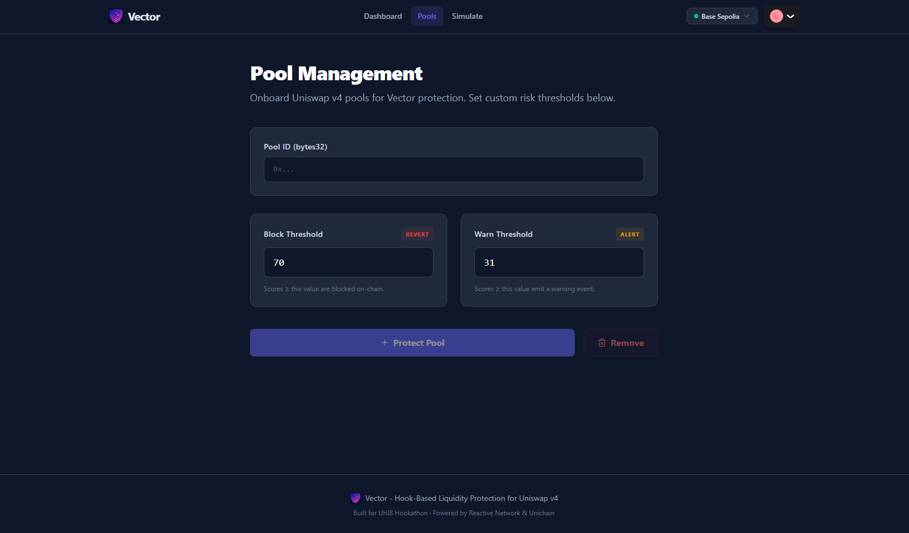
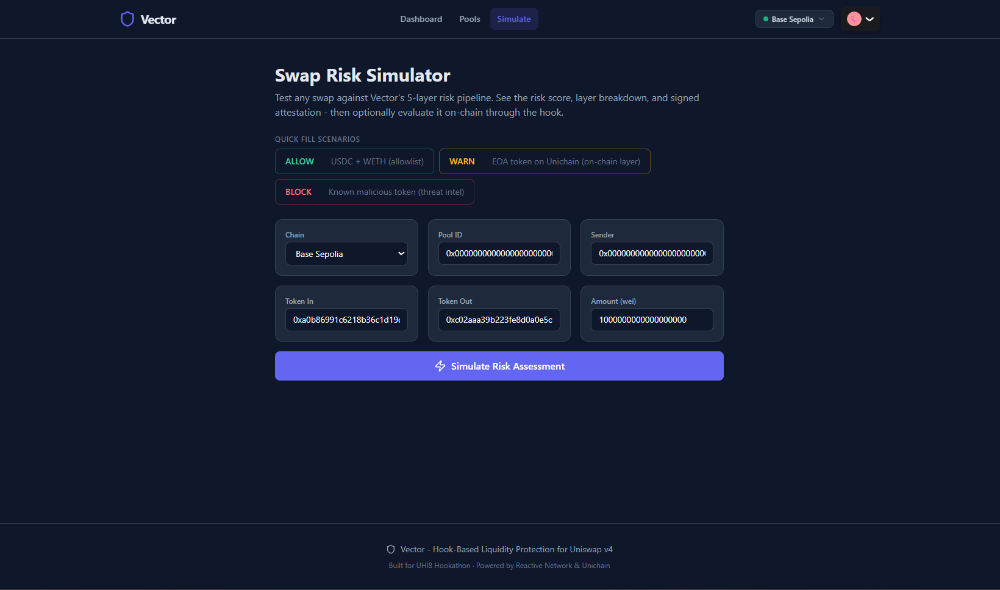
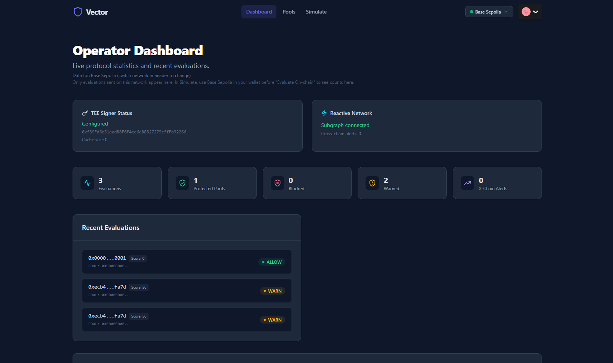
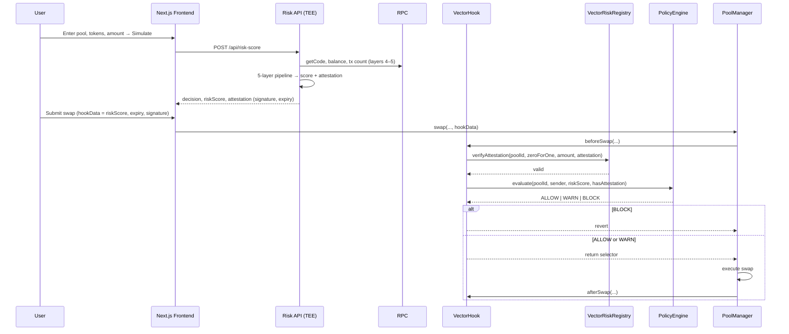
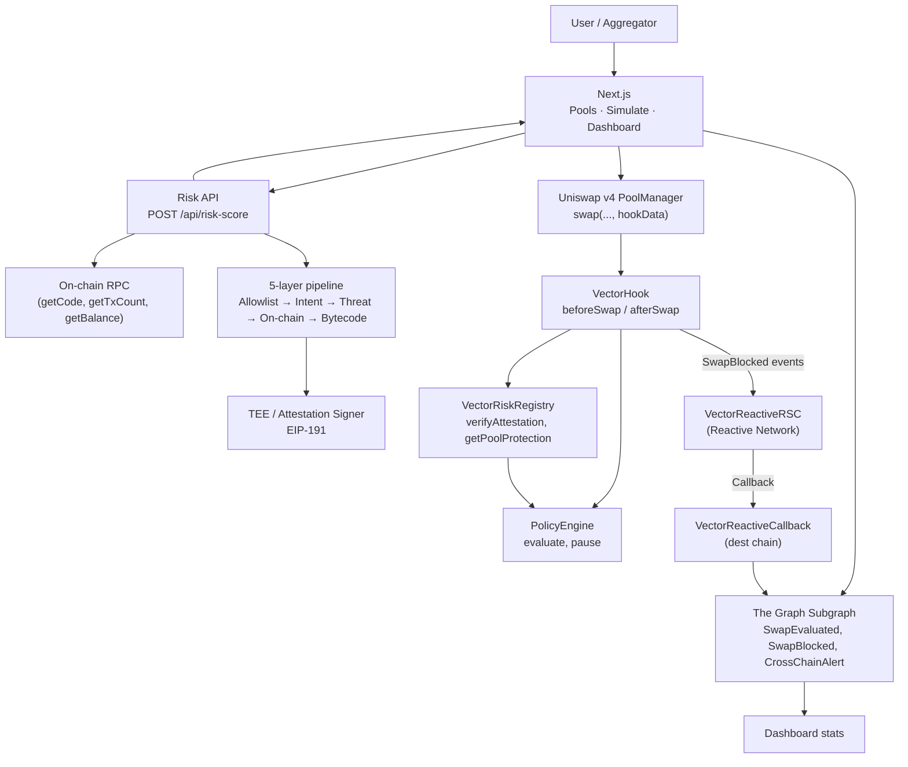

# Vector

*Pool protection that can't be bypassed, enforced in the hook.*

Most pool protection lives off-chain or in the UI. You rely on routing filters or wallet warnings. But once a swap hits the PoolManager, nothing on-chain stops it. Vector moves the check into the Uniswap v4 hook. Protected pools get attestation-gated execution; the revert is in Solidity.

**UHI8 Hookathon** · **Reactive Network** & **Unichain** sponsor tracks.

---

## Screenshots

<table align="center">
  <tr>
    <td align="center">
      
      <br>
      <sub><i>Pool onboarding</i></sub>
    </td>
    <td align="center">
      
      <br>
      <sub><i>Swap risk simulator</i></sub>
    </td>
    <td align="center">
      
      <br>
      <sub><i>Operator dashboard</i></sub>
    </td>
  </tr>
</table>


---

## Inspiration

Uniswap v4 pools are permissionless. Anyone can create a pool and anyone can swap. That's the point, until it isn't. Large-cap pairs, institutional liquidity, and specialized markets don't want “anyone”: they want to keep toxic flow, known scam tokens, and obvious MEV abuse out of their liquidity without turning the pool into a closed garden.

Existing answers are off-chain (routing filters, aggregator blocklists) or pre-trade (warnings in a wallet). Once a swap is submitted to the PoolManager, nothing on-chain says “this destination token is a drainer” or “this swap size is anomalous.” The execution step is wide open.

We asked: what if the **hook** enforced risk at execution time? Not a blacklist in a frontend. A revert inside the hook, so that even a direct RPC submission can't drain liquidity to a flagged token. Security at the pool edge, in Solidity.

---

## Features

- **Attestation-gated swaps** : Off-chain risk engine scores every swap; TEE (or dev signer) signs. Hook verifies signature and enforces ALLOW / WARN / BLOCK. No bypass.
- **Hybrid policy** : Protected pools: fail-closed (no attestation = BLOCK). Unprotected: fail-open so the AMM stays permissionless. Pool operators choose.
- **5-layer risk pipeline** : Allowlist, swap intent, threat intel (GoPlus), on-chain signals, bytecode. Scores 0–100; configurable block/warn thresholds per pool.
- **Reactive + Unichain** : RSC monitors SwapBlocked; after 3 blocks per (actor, pool) triggers cross-chain callback. Deployed on Base Sepolia and Unichain Sepolia with chain selector in the UI.
- **Dashboard + subgraph** : Operator dashboard (stats, evaluations, signer status, cross-chain alerts). The Graph indexes hook, registry, policy, and callback events.

---

## What We Built

Vector is a Uniswap v4 hook that gates swaps using **cryptographic risk attestations**. Before a swap executes, the hook decodes `hookData`, verifies an off-chain risk engine's signature over the swap context (pool, direction, amount, score, expiry, chain), and enforces a **hybrid policy** per pool: protected pools are fail-closed (no valid attestation → revert); unprotected pools are fail-open (always allow, emit warn on high risk). The guarantee lives in the hook's `revert`. No frontend or RPC filter to bypass.

When a user (or aggregator) wants to swap: frontend calls the risk API, the risk engine runs a 5-layer pipeline, the TEE (or dev signer) signs an attestation, the frontend encodes (riskScore, expiry, signature) into hookData, the user submits the swap, and VectorHook.beforeSwap() verifies attestation and policy. Result: ALLOW, WARN, or BLOCK. BLOCK means revert. Nothing to bypass; the check is the hook.

**What runs on every swap:**

```
Every swap (beforeSwap) →
   VectorRiskRegistry: Pool protected? Get thresholds. Decode hookData.
        ↓
   verifyAttestation: ECDSA recover TEE signer; expiry and message = (poolId, zeroForOne, amountSpecified, riskScore, expiry, chainId)
        ↓
   PolicyEngine.evaluate: score vs block/warn thresholds; pool mode (protected vs unprotected)
        ↓
   ALLOW → pass through  |  WARN → emit, pass  |  BLOCK → revert
```

**Policy quick reference:**

| Pool type   | Has attestation | Score &lt; warn | Warn ≤ score &lt; block | Score ≥ block   |
|------------|------------------|----------------|--------------------------|-----------------|
| **Protected** | Yes              | ALLOW          | WARN (emit)               | BLOCK (revert)  |
| **Protected** | No               | BLOCK          | BLOCK                     | BLOCK           |
| **Unprotected** | Yes            | ALLOW          | WARN (emit)               | WARN (emit)     |
| **Unprotected** | No             | ALLOW          | ALLOW                     | ALLOW           |

Default thresholds: `warnThreshold = 31`, `blockThreshold = 70`. Attestation TTL is 5 minutes (risk engine).

**Risk scoring (0–100) is 5 layers:**

| Layer | Name | What it does |
|-------|------|----------------|
| 1 | **Allowlist** | Trusted tokens/pools → score 0, fast path |
| 2 | **Swap intent** | Large swaps, micro swaps → anomaly signals |
| 3 | **Threat intel** | GoPlus API + known malicious tokens |
| 4 | **On-chain signals** | EOA vs contract, tx history, balance |
| 5 | **Bytecode** | SELFDESTRUCT, DELEGATECALL, proxy patterns |

Scores aggregate; the TEE (or dev signer) signs once per assessment; the hook enforces on every swap.

### The TEE: Vector's brain (unbypassable)

The **Trusted Execution Environment** runs the risk pipeline and signs attestations the hook trusts. No swap through a protected pool executes without a valid attestation; an attacker can't forge one, replay one (bound to poolId, direction, amount, chainId), or skip the check.

**Why it's foolproof:**

- **Attestation is bound to the exact swap.** The signer signs `keccak256(abi.encode(poolId, zeroForOne, amountSpecified, riskScore, expiry, chainId))`. You can't reuse a valid attestation for another pool, amount, or chain. On-chain `verifyAttestation()` checks ECDSA and expiry.
- **Enforcement is in the hook.** Protection lives in `beforeSwap()` (Solidity revert). No RPC or frontend filter can be bypassed; the contract refuses to let the swap proceed.
- **Hybrid policy.** Protected pools get fail-closed (no attestation → BLOCK). Unprotected pools stay permissionless (fail-open). Pool operators choose; the hook doesn't censor the whole AMM.

**External dependencies:** GoPlus Security API (threat intel), on-chain RPC for layer 4, TEE signing (Phala CVM or server-side key for testnet). Same attestation format and on-chain verification in both modes.

---

## Swap Flow Diagram

How a swap moves from user intent to risk API to attestation to hook enforcement.



---

## Architecture Diagram

System components and trust boundaries.



---

## Sponsor Bounty Integrations

| Sponsor | What we built |
|--------|----------------|
| **Reactive Network** | **VectorReactiveRSC** (on Reactive) subscribes to `SwapBlockedByPolicy` from the hook. Counts blocks per (actor, poolId); after 3 blocks, triggers a cross-chain **Callback** with encoded alert payload. **VectorReactiveCallback** (on Base Sepolia / Unichain Sepolia) receives the callback, stores the risk alert, and emits `CrossChainRiskAlert` for the subgraph. Multi-chain threat propagation without bridges. |
| **Unichain** | Full Vector stack deployed on **Unichain Sepolia** (chainId 1301) alongside Base Sepolia. Frontend chain selector (Base Sepolia / Unichain Sepolia), shared chain profiles and threshold presets in `@vector/shared`. Same hook, registry, policy, and risk API; attestation payload includes `chainId` so one engine can serve both chains. |

---

## Deployed Contracts

**Base Sepolia** (chainId 84532)

| Contract | Address |
|----------|---------|
| VectorGovernance | [`0x078Caca2c7580caA9a571368c9B21c722fc48e52`](https://sepolia.basescan.org/address/0x078Caca2c7580caA9a571368c9B21c722fc48e52) |
| VectorRiskRegistry | [`0x2478f2e45b9eF70EFb28f5fFFf4F695C14363B91`](https://sepolia.basescan.org/address/0x2478f2e45b9eF70EFb28f5fFFf4F695C14363B91) |
| PolicyEngine | [`0xda87f7DcBa74949f750D64C9D99E67aD8De4Ab6e`](https://sepolia.basescan.org/address/0xda87f7DcBa74949f750D64C9D99E67aD8De4Ab6e) |
| VectorHook | [`0xB4012dBb91b1B1b9eB8609B6bfd57b377556933D`](https://sepolia.basescan.org/address/0xB4012dBb91b1B1b9eB8609B6bfd57b377556933D) |
| VectorReactiveCallback | [`0x22f75f72Ab5e515182c579F904089e1De1F21cB1`](https://sepolia.basescan.org/address/0x22f75f72Ab5e515182c579F904089e1De1F21cB1) |

**Unichain Sepolia** (chainId 1301)

| Contract | Address |
|----------|---------|
| VectorGovernance | `0xb371542bE9829175baD89855d4C86f50F11803C8` |
| VectorRiskRegistry | `0x27142bFCa9Ac9B7FaE773d46656deBF4f4E39aAe` |
| PolicyEngine | `0xa1Afa7158d8d47D66E00B6891ea54B35B0840cf4` |
| VectorHook | `0x9fe666729cCe60645b4e9ec4672A7C9cCa9FE87f` |
| VectorReactiveCallback | `0xdeE66A4e8aAf73e47634B96bb65D7011deb0073C` |

---

## Challenges We Faced

**Attestation binding.** The hook had to trust “this score applies to this swap” without re-running the pipeline on-chain. Binding the signed message to `(poolId, zeroForOne, amountSpecified, riskScore, expiry, chainId)` meant the risk engine and the registry had to share the exact encoding. One mismatch and verification fails; we aligned the signer and `verifyAttestation()` so replay across pool, amount, or chain is impossible.

**Hybrid policy without censorship.** We wanted protected pools to be strict (fail-closed) but didn't want the hook to force every pool to be protected. PolicyEngine evaluates pool mode (from the registry) and attestation presence: protected + no attestation → BLOCK; unprotected → always ALLOW, with WARN as a signal. That keeps liquidity permissionless by default and lets pool operators opt into enforcement.

**Reactive callback auth.** VectorReactiveCallback on the destination chain must accept callbacks only from the authorized RSC. We use an owner-managed authorized caller so only the Reactive-deployed RSC address can invoke the callback; revoke is supported for rotation.

**Integration test in one run.** The full path (risk API → attestation → hook.evaluateSwap) requires a running risk engine with TEE_SIGNER_KEY, deployed contracts, and the same signer registered in the registry. We added a single script that deploys locally, fetches the signer from the health endpoint, configures the registry, and runs a swap with a valid attestation so the whole pipeline is testable in one go.

---

## What We Learned

Security at the pool edge is different from security in a wallet. In a wallet you're protecting one user's keys. In a hook you're protecting a pool's liquidity from bad flow without turning the pool into a private club. The hybrid model (protected vs unprotected, fail-closed vs fail-open) made the hook enforceable where it matters and invisible where it doesn't.

Off-chain risk plus on-chain attestation verification is the right split. Heavy scoring (five layers, RPC calls, GoPlus) stays off-chain. The hook does one ECDSA recover and a threshold check. Gas stays low; the guarantee stays in the contract.

Reactive's “subscribe on one chain, act on another” fit Vector well. SwapBlocked on Base or Unichain becomes a cross-chain alert. Repeat offenders get tracked across chains without a bridge. Just an RSC and a callback contract.

---

## Setup Instructions

### Prerequisites

- Node.js 18+
- Testnet ETH ([Base Sepolia faucet](https://www.alchemy.com/faucets/base-sepolia))
- For attestation: set `TEE_SIGNER_KEY` in risk-engine (and register signer on registry after deploy)

### Contracts

1. Navigate to the contracts directory:
```bash
cd contracts
```

2. Install dependencies and copy env:
```bash
npm install
cp .env.example .env
```
3. Add `DEPLOYER_PRIVATE_KEY` (and optional RPC URLs) to `.env`.

4. Compile and test:
```bash
npx hardhat compile
npx hardhat test
```

5. Deploy (optional; use addresses in README for frontend):
```bash
npx hardhat run scripts/deploy.js --network baseSepolia
npx hardhat run scripts/deploy.js --network unichainSepolia
npm run copy-abis && node scripts/update-subgraph-addresses.js baseSepolia
```

### Risk engine

1. Navigate to the risk engine:
```bash
cd risk-engine
```

2. Install and copy env:
```bash
npm install
cp .env.example .env
```
3. Set `TEE_SIGNER_KEY` in `.env` (or leave unset for no attestations). Run tests: `node src/test.js`.

4. Start the API server:
```bash
node src/server.js
```
Server runs at `http://localhost:3001`. Health: `GET /api/health`. Risk: `POST /api/risk-score`.

### Frontend

1. Navigate to the frontend:
```bash
cd frontend
```

2. Install and copy env:
```bash
npm install
cp .env.example .env
```
3. Fill in contract addresses, `NEXT_PUBLIC_RISK_API_URL=http://localhost:3001`, `NEXT_PUBLIC_SUBGRAPH_URL`, and `NEXT_PUBLIC_WC_PROJECT_ID`.

4. Start the dev server:
```bash
npm run dev
```
App runs at [http://localhost:3000](http://localhost:3000). Use **Pools** (set protection), **Simulate** (risk + attestation), **Dashboard** (stats + evaluations). Set `NEXT_PUBLIC_MOCK_RISK=1` to use mock risk when the risk API is down.

### Subgraph (optional, after deploy)

1. From `contracts/`, run `npm run copy-abis && node scripts/update-subgraph-addresses.js baseSepolia` so the subgraph has deployed addresses.
2. In `subgraph/`: `npm install`, then `npm run codegen && npm run build && npm run deploy`. See [docs/subgraph-studio.md](docs/subgraph-studio.md) for Studio auth and deploy.
3. Set `NEXT_PUBLIC_SUBGRAPH_URL` in frontend `.env` to the Query URL from Studio.

---

## Testing

```bash
cd contracts && npx hardhat test
```

**Contract tests (15):** VectorRiskRegistry (pool config), PolicyEngine (ALLOW/WARN/BLOCK, pause), VectorHook (attestation verify, replay failure, expiry, unprotected WARN). Reactive: VectorReactiveCallback (unauthorized revert, authorized callback, revoke).

```bash
cd risk-engine && npm run test
```

**Risk engine (17):** Allowlist, swap intent, threat intel, attestation signing, cache.

```bash
cd frontend && npm run test:e2e
```

**E2E (Playwright, 5):** Landing, simulate (with mock), dashboard, pools.

**Integration (risk API → hook):** With risk engine running and `TEE_SIGNER_KEY` set:

```bash
cd contracts && RISK_API_URL=http://localhost:3001 npx hardhat run scripts/integration-test.js --network hardhat
```

---

## 🛠️ Tech Stack

- **Contracts:** Solidity, Hardhat, OpenZeppelin, Uniswap v4 periphery (hook interfaces)
- **Risk engine:** Node.js, Express, ethers, 5-layer pipeline, EIP-191 attestation signer
- **Frontend:** Next.js 15, TypeScript, Tailwind, wagmi, RainbowKit, TanStack Query
- **Indexing:** The Graph (subgraph for hook, registry, policy, Reactive callback events)
- **Networks:** Base Sepolia, Unichain Sepolia

---

## License

MIT. See [LICENSE](LICENSE) for details.

------------------------

Built with ❤️ by [Apoorva Agrawal](https://github.com/imApoorva36) · [GitHub](https://github.com/imApoorva36) · [X @im__apoorva](https://x.com/im__apoorva)
