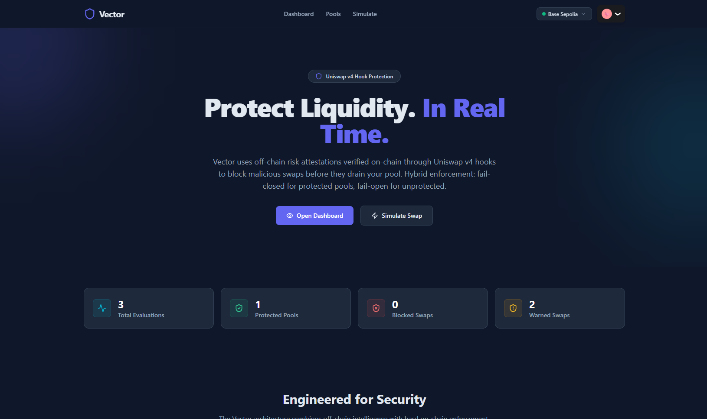
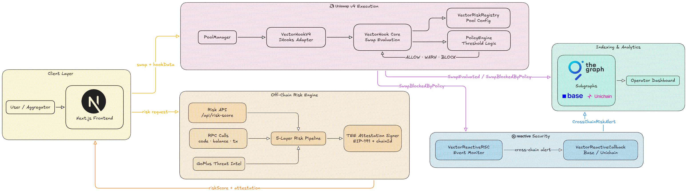

# Vector

<p align="center">
  
</p>

_Pool protection that can't be bypassed, enforced in the hook._

Most pool protection lives off-chain or in the UI. You rely on routing filters or wallet warnings. But once a swap hits the PoolManager, nothing on-chain stops it. Vector moves the check into the Uniswap v4 hook. Protected pools get attestation-gated execution; the revert is in Solidity.

**UHI8 Hookathon** · **Reactive Network** & **Unichain** sponsor tracks.

---

## Screenshots

<table align="center">
  <tr>
    <td align="center">
      
      <br>
      <sub><i>Landing page · hero & how it works</i></sub>
    </td>
    <td align="center">
      
      <br>
      <sub><i>Pool onboarding · set protection & thresholds</i></sub>
    </td>
  </tr>
  <tr>
    <td align="center">
      
      <br>
      <sub><i>Risk simulator · ALLOW / WARN / BLOCK</i></sub>
    </td>
    <td align="center">
      
      <br>
      <sub><i>Operator dashboard · stats & evaluations</i></sub>
    </td>
  </tr>
</table>

---

## Architecture Diagram

<p align="center">
  
</p>

---

## Demo

**Demo video:** [https://youtu.be/70oRLIqGET8](https://youtu.be/70oRLIqGET8)

---

## Inspiration

Uniswap v4 pools are permissionless. Anyone can create a pool and anyone can swap. That's the point, until it isn't. Large-cap pairs, institutional liquidity, and specialized markets don't want “anyone”: they want to keep toxic flow, known scam tokens, and obvious MEV abuse out of their liquidity without turning the pool into a closed garden.

Existing answers are off-chain (routing filters, aggregator blocklists) or pre-trade (warnings in a wallet). Once a swap is submitted to the PoolManager, nothing on-chain says “this destination token is a drainer” or “this swap size is anomalous.” The execution step is wide open.

We asked: what if the **hook** enforced risk at execution time? Not a blacklist in a frontend. A revert inside the hook, so that even a direct RPC submission can't drain liquidity to a flagged token. Security at the pool edge, in Solidity.

---

## Features

- **Attestation-gated swaps** : Off-chain risk engine scores every swap; TEE (or dev signer) signs. Hook verifies signature and enforces ALLOW / WARN / BLOCK. No bypass.
- **Hybrid policy** : Protected pools: fail-closed (no attestation = BLOCK). Unprotected: fail-open so the AMM stays permissionless. Pool operators choose.
- **5-layer risk pipeline** : Allowlist, swap intent, threat intel (known drainer/phishing/tornado patterns + GoPlus), on-chain signals (registry blacklist + freshness heuristics), bytecode. Scores 0–100; configurable block/warn thresholds per pool.
- **Reactive + Unichain** : RSC monitors SwapBlocked; after 3 blocks per (actor, pool) triggers cross-chain callback. Deployed on Base Sepolia and Unichain Sepolia with chain selector in the UI.
- **Dashboard + subgraph** : Operator dashboard (stats, evaluations, signer status, cross-chain alerts). The Graph indexes hook, registry, policy, and callback events.

---

## What We Built

Vector is a Uniswap v4 hook that gates swaps using **cryptographic risk attestations**. Before a swap executes, the hook decodes `hookData`, verifies an off-chain risk engine's signature over the swap context (pool, direction, amount, score, expiry, chain), and enforces a **hybrid policy** per pool: protected pools are fail-closed (no valid attestation → revert); unprotected pools are fail-open (always allow, emit warn on high risk). The guarantee lives in the hook's `revert`. No frontend or RPC filter to bypass.

When a user (or aggregator) wants to swap: frontend calls the risk API, the risk engine runs a 5-layer pipeline, the TEE (or dev signer) signs an attestation, the frontend encodes (riskScore, expiry, signature) into hookData, the user submits the swap, and `VectorHookV4.beforeSwap()` verifies attestation and policy. Result: ALLOW, WARN, or BLOCK. BLOCK means revert. Nothing to bypass; the check is the hook.

> **Two-layer hook design:** `VectorHook` is the standalone core contract — it owns `evaluateSwap()` and can be called directly in tests or via integrations. `VectorHookV4` is the Uniswap v4 `IHooks` adapter: its `beforeSwap()` delegates to `VectorHook.evaluateSwap()`, and `afterSwap()` emits `SwapExecuted`. `VectorHookV4` is deployed only when `POOL_MANAGER_ADDRESS` is configured; guarded by `onlyPoolManager`. This split keeps the core logic fully testable without a PoolManager and makes the hook lifecycle layer thin and auditable.

**What runs on every swap:**

```
Every swap (beforeSwap) →
   VectorRiskRegistry: Pool protected? Get thresholds. Decode hookData.
        ↓
   verifyAttestation: ECDSA recover TEE signer; expiry and message = (poolId, zeroForOne, amountSpecified, riskScore, expiry, chainId)
        ↓
   PolicyEngine.evaluate: score vs block/warn thresholds; pool mode (protected vs unprotected)
        ↓
   ALLOW → pass through  |  WARN → emit, pass  |  BLOCK → revert
```

**Policy quick reference:**

| Pool type       | Has attestation | Score &lt; warn | Warn ≤ score &lt; block | Score ≥ block  |
| --------------- | --------------- | --------------- | ----------------------- | -------------- |
| **Protected**   | Yes             | ALLOW           | WARN (emit)             | BLOCK (revert) |
| **Protected**   | No              | BLOCK           | BLOCK                   | BLOCK          |
| **Unprotected** | Yes             | ALLOW           | WARN (emit)             | WARN (emit)    |
| **Unprotected** | No              | ALLOW           | ALLOW                   | ALLOW          |

Default thresholds: `warnThreshold = 31`, `blockThreshold = 70`. Attestation TTL is 5 minutes (risk engine).

**Risk scoring (0–100) is 5 layers:**

| Layer | Name                 | What it does                               |
| ----- | -------------------- | ------------------------------------------ |
| 1     | **Allowlist**        | Trusted tokens/pools → score 0, fast path  |
| 2     | **Swap intent**      | Large swaps, micro swaps → anomaly signals |
| 3     | **Threat intel**     | GoPlus API + known malicious tokens        |
| 4     | **On-chain signals** | EOA vs contract, tx history, balance       |
| 5     | **Bytecode**         | SELFDESTRUCT, DELEGATECALL, proxy patterns |

Scores aggregate; the TEE (or dev signer) signs once per assessment; the hook enforces on every swap.

### The TEE: Vector's brain (unbypassable)

The **Trusted Execution Environment** runs the risk pipeline and signs attestations the hook trusts. No swap through a protected pool executes without a valid attestation; an attacker can't forge one, replay one (bound to poolId, direction, amount, chainId), or skip the check.

**Why it's foolproof:**

- **Attestation is bound to the exact swap.** The signer signs `keccak256(abi.encode(poolId, zeroForOne, amountSpecified, riskScore, expiry, chainId))`. You can't reuse a valid attestation for another pool, amount, or chain. On-chain `verifyAttestation()` checks ECDSA and expiry.
- **Enforcement is in the hook.** Protection lives in `beforeSwap()` (Solidity revert). No RPC or frontend filter can be bypassed; the contract refuses to let the swap proceed.
- **Hybrid policy.** Protected pools get fail-closed (no attestation → BLOCK). Unprotected pools stay permissionless (fail-open). Pool operators choose; the hook doesn't censor the whole AMM.

**External dependencies:** GoPlus Security API (threat intel), on-chain RPC for layer 4, TEE signing (Phala CVM or server-side key for testnet). Same attestation format and on-chain verification in both modes.

---

## Sponsor Bounty Integrations

| Sponsor              | Bounty / Track | What we built                                                                                                                                                                                                                                                                                                                                                                                                             |
| -------------------- | -------------- | ------------------------------------------------------------------------------------------------------------------------------------------------------------------------------------------------------------------------------------------------------------------------------------------------------------------------------------------------------------------------------------------------------------------------- |
| **Reactive Network** | Reactive RSC   | **VectorReactiveRSC** (on Reactive) subscribes to `SwapBlockedByPolicy` from the hook. Counts blocks per (actor, poolId); after 3 blocks, triggers a cross-chain **Callback** with encoded alert payload. **VectorReactiveCallback** (on Base Sepolia / Unichain Sepolia) receives the callback, stores the risk alert, and emits `CrossChainRiskAlert` for the subgraph. Multi-chain threat propagation without bridges. |
| **Unichain**         | Unichain       | Full Vector stack deployed on **Unichain Sepolia** (chainId 1301) alongside Base Sepolia. Frontend chain selector (Base Sepolia / Unichain Sepolia), shared chain profiles and threshold presets in `@vector/shared`. Same hook, registry, policy, and risk API; attestation payload includes `chainId` so one engine can serve both chains.                                                                              |

---

## Deployed Contracts

Addresses are synced from `contracts/deployments/*.json` after each deploy.

**Base Sepolia** (chainId 84532)

| Contract               | Address                                                                                                                         |
| ---------------------- | ------------------------------------------------------------------------------------------------------------------------------- |
| VectorGovernance       | [`0x73a75069F8AB6cEFcF6B507Bee8a74FBc0CbAa2F`](https://sepolia.basescan.org/address/0x73a75069F8AB6cEFcF6B507Bee8a74FBc0CbAa2F) |
| VectorRiskRegistry     | [`0x1E754605713ee61Bce2977FE1f86a686b275fD6e`](https://sepolia.basescan.org/address/0x1E754605713ee61Bce2977FE1f86a686b275fD6e) |
| PolicyEngine           | [`0x408e2f6abC0d64a1036959bb6be95554BA855da4`](https://sepolia.basescan.org/address/0x408e2f6abC0d64a1036959bb6be95554BA855da4) |
| VectorHook             | [`0x87277cCc902b42Be9b73dC228C6CA4F7F96A0B95`](https://sepolia.basescan.org/address/0x87277cCc902b42Be9b73dC228C6CA4F7F96A0B95) |
| VectorReactiveCallback | [`0x22A29B673Bd1fF3c7E74CD1F3a68a1572be5D26D`](https://sepolia.basescan.org/address/0x22A29B673Bd1fF3c7E74CD1F3a68a1572be5D26D) |

**Unichain Sepolia** (chainId 1301)

| Contract               | Address                                      |
| ---------------------- | -------------------------------------------- |
| VectorGovernance       | `0x5a7eBfF6a201C55a5800eB04f0956ADD1FB711bd` |
| VectorRiskRegistry     | `0x45fBE3e0B46c3E64d52A93649350314A33112430` |
| PolicyEngine           | `0x38612802c15dFcBb880c61c85404CF89C3e13Ae3` |
| VectorHook             | `0xbC03dD238c58AF8f9a423c03c8f42EE8ABC63B98` |
| VectorReactiveCallback | `0x04040391C0a74918155e1A142E65aF709D0bc72B` |

---

## Challenges We Faced

**Attestation binding.** The hook had to trust “this score applies to this swap” without re-running the pipeline on-chain. Binding the signed message to `(poolId, zeroForOne, amountSpecified, riskScore, expiry, chainId)` meant the risk engine and the registry had to share the exact encoding. One mismatch and verification fails; we aligned the signer and `verifyAttestation()` so replay across pool, amount, or chain is impossible.

**Hybrid policy without censorship.** We wanted protected pools to be strict (fail-closed) but didn't want the hook to force every pool to be protected. PolicyEngine evaluates pool mode (from the registry) and attestation presence: protected + no attestation → BLOCK; unprotected → always ALLOW, with WARN as a signal. That keeps liquidity permissionless by default and lets pool operators opt into enforcement.

**Reactive callback auth.** VectorReactiveCallback on the destination chain must accept callbacks only from the authorized RSC. We use an owner-managed authorized caller so only the Reactive-deployed RSC address can invoke the callback; revoke is supported for rotation.

**Integration test in one run.** The full path (risk API → attestation → hook.evaluateSwap) requires a running risk engine with TEE_SIGNER_KEY, deployed contracts, and the same signer registered in the registry. We added a single script that deploys locally, fetches the signer from the health endpoint, configures the registry, and runs a swap with a valid attestation so the whole pipeline is testable in one go.

---

## What We Learned

Security at the pool edge is different from security in a wallet. In a wallet you're protecting one user's keys. In a hook you're protecting a pool's liquidity from bad flow without turning the pool into a private club. The hybrid model (protected vs unprotected, fail-closed vs fail-open) made the hook enforceable where it matters and invisible where it doesn't.

Off-chain risk plus on-chain attestation verification is the right split. Heavy scoring (five layers, RPC calls, GoPlus) stays off-chain. The hook does one ECDSA recover and a threshold check. Gas stays low; the guarantee stays in the contract.

Reactive's “subscribe on one chain, act on another” fit Vector well. SwapBlocked on Base or Unichain becomes a cross-chain alert. Repeat offenders get tracked across chains without a bridge. Just an RSC and a callback contract.

---

## Architecture notes

- **Subgraph:** The Graph subgraph has separate manifests for **Base Sepolia** (`subgraph/subgraph.yaml`) and **Unichain Sepolia** (`subgraph/subgraph-unichain.yaml`). The dashboard reads `HookSwapEvaluated`, `SwapBlockedByPolicy`, and `CrossChainRiskAlert` from the subgraph. **Both** subgraphs are deployed: set `NEXT_PUBLIC_SUBGRAPH_URL` (Base) and `NEXT_PUBLIC_SUBGRAPH_URL_1301` (Unichain) in `frontend/.env`. Deploy with `npm run copy-abis && node scripts/update-subgraph-addresses.js <network>` after contract deploy.
- **Risk engine (embedded in frontend):** The 5-layer risk pipeline and attestation signing run in the **Next.js API** (`frontend/app/api/risk-score/`). No separate server is required. Set `TEE_SIGNER_KEY` in `frontend/.env`; the same signer must be registered in VectorRiskRegistry for attestation verification.

---

## Setup Instructions

### Prerequisites

- Node.js 18+
- Testnet ETH ([Base Sepolia faucet](https://www.alchemy.com/faucets/base-sepolia))
- For attestation: set `TEE_SIGNER_KEY` in `frontend/.env` (and register signer on registry after deploy)

### Contracts

1. Navigate to the contracts directory:

```bash
cd contracts
```

2. Install dependencies and copy env:

```bash
npm install
cp .env.example .env
```

3. Add `DEPLOYER_PRIVATE_KEY` (and optional RPC URLs) to `.env`.

4. Compile and test:

```bash
npx hardhat compile
npx hardhat test
```

Optional: run coverage (`npm run coverage`) for a line/statement/function/branch report; see [Testing](#testing) below.

5. Deploy (optional; use addresses in README for frontend):

```bash
npx hardhat run scripts/deploy.js --network baseSepolia
npx hardhat run scripts/deploy.js --network unichainSepolia
npm run copy-abis && node scripts/update-subgraph-addresses.js baseSepolia
```

### Frontend

1. Navigate to the frontend:

```bash
cd frontend
```

2. Install and copy env:

```bash
npm install
cp .env.example .env
```

3. Fill in `TEE_SIGNER_KEY` (attestation signer private key), `RPC_URL`, contract addresses, and `NEXT_PUBLIC_SUBGRAPH_URL`. The 5-layer risk pipeline runs inside Next.js API routes - no separate server needed.

Layer 4 blacklist checks are read directly from `VectorRiskRegistry.isBlacklisted(token)` on-chain.
Use registry owner methods `setTokenBlacklist` / `batchSetTokenBlacklist` to update blocked tokens.

4. Start the dev server:

```bash
npm run dev
```

App runs at [http://localhost:3000](http://localhost:3000). Use **Pools** (set protection), **Simulate** (risk + attestation), **Dashboard** (stats + evaluations).

### Subgraph (optional, after deploy)

1. From `contracts/`, run `npm run copy-abis && node scripts/update-subgraph-addresses.js baseSepolia` so the subgraph has deployed addresses.
2. In `subgraph/`: `npm install`, then run `npm run codegen && npm run build`.
3. Authenticate Graph CLI and deploy from `subgraph/`:

```bash
npx graph auth --studio <DEPLOY_KEY>
npm run deploy
```

Use your Subgraph Studio deploy key and make sure `network` in the selected manifest (`subgraph.yaml` or `subgraph-unichain.yaml`) matches your target chain.
4. Set `NEXT_PUBLIC_SUBGRAPH_URL` in frontend `.env` to the Query URL from Studio.

---

## Testing

### Contract tests

```bash
cd contracts && npx hardhat test
```

**46 tests** across:

- **VectorRiskRegistry:** pool protection config, default config for unknown pool, set/remove pool protection, setRiskThreshold, token blacklist (including batch with zero-address skip), TEE signer, verifyAttestation (valid, expired, invalid signature length/v, TEE not configured, default threshold when riskThreshold is 0).
- **PolicyEngine:** evaluate ALLOW/WARN/BLOCK (protected/unprotected, with/without attestation, paused), setThresholds, pause/unpause.
- **VectorHook:** evaluateSwap (no attestation revert, valid attestation ALLOW, replay revert, paused revert, expired revert, high-risk attestation revert, unprotected WARN, hookData score-only when TEE not configured), emitSwapExecuted.
- **VectorHookV4:** onlyPoolManager modifier (revert when non-PoolManager calls beforeSwap/afterSwap), PoolManager beforeSwap (revert when hook blocks, success when hook allows), PoolManager afterSwap (emits SwapExecuted), immutables.
- **VectorReactiveCallback:** unauthorized revert, authorize/revoke RSC, callback and CrossChainRiskAlert, getAlertCount, getLatestAlert (including empty struct for unknown poolId).
- **VectorGovernance:** initial owner, Ownable2Step transferOwnership + acceptOwnership.

### Coverage

```bash
cd contracts && npm run coverage
```

- **Statements / Lines / Functions:** 100%
- **Branches:** 85%+ (solidity-coverage; report in `coverage/` and `coverage.json`)

### E2E (Playwright)

```bash
cd frontend && npm run test:e2e
```

**5 E2E tests:** Landing, simulate (risk assessment), dashboard, pools.

### Risk pipeline scenarios (Simulate quick-fills)

To confirm the risk API returns ALLOW, WARN, and BLOCK for the demo scenarios:

```bash
cd frontend && node scripts/test-risk-scenarios.js
```

Uses the same engine as the app (no separate server); requires `RPC_URL` (or default Base Sepolia) in `frontend/.env` for on-chain/bytecode layers.

### Integration (risk API → hook)

With frontend running (`TEE_SIGNER_KEY` set in `frontend/.env`):

```bash
# Terminal 1: start frontend with TEE_SIGNER_KEY
cd frontend && npm run dev

# Terminal 2: run integration test
cd contracts && npx hardhat run scripts/integration-test.js --network hardhat
```

### Risk engine standalone tests

```bash
cd risk-engine && npm run test
```

---

## Tech Stack

- **Contracts:** Solidity, Hardhat, OpenZeppelin, Uniswap v4 periphery (hook interfaces)
- **Risk engine:** Node.js (embedded in Next.js API routes), 5-layer pipeline, on-chain registry blacklist checks, EIP-191 attestation signer
- **Frontend:** Next.js 15, TypeScript, Tailwind, wagmi, RainbowKit, TanStack Query, wallet context + shared tx error mapping
- **Indexing:** The Graph (subgraph for hook, registry, policy, Reactive callback events)
- **Networks:** Base Sepolia, Unichain Sepolia

---

## License

MIT. See [LICENSE](LICENSE) for details.

---

Built with ❤️ by Apoorva Agrawal · [GitHub](https://github.com/imApoorva36) · [X / Twitter](https://x.com/im__apoorva) · [Discord](https://discord.com/users/imapoorva)
